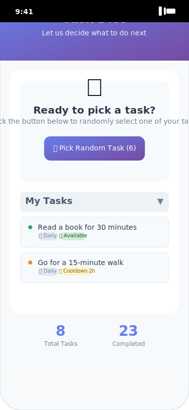
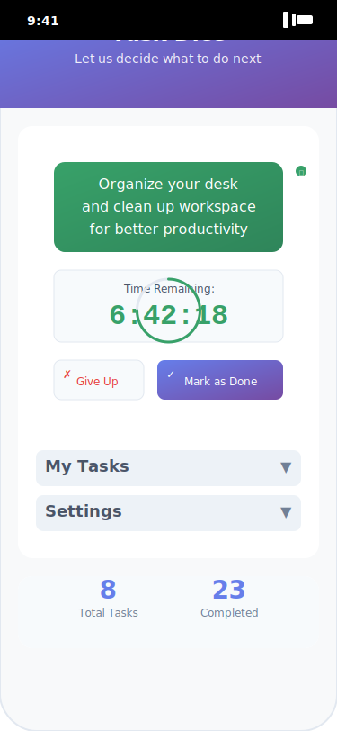

# Development Guide - Task Dice

This guide is for developers who want to contribute to or customize the Task Dice app.

## 📱 App Interface Overview

<p align="center">
  
  
  
</p>

*See [screenshots documentation](screenshots/README.md) for detailed UI explanations.*

## 🚀 Getting Started

### Prerequisites
- Modern web browser (Chrome 60+, Firefox 55+, Safari 11+, Edge 79+)
- Text editor or IDE
- Basic knowledge of HTML5, CSS3, and JavaScript ES6+
- Local web server for PWA testing (optional)

### Setup
1. Clone or download the repository
2. Open `index.html` directly in browser for basic testing
3. For PWA features, serve locally:
   ```bash
   # Python
   python -m http.server 8000
   
   # Node.js
   npx serve
   
   # PHP
   php -S localhost:8000
   ```

## 📁 Project Structure

```
TaskDice/
├── index.html              # Main app entry point
├── styles.css              # Mobile-first CSS
├── script.js               # Core app logic
├── manifest.json           # PWA manifest
├── sw.js                   # Service Worker
├── debug-test.html         # Debug utility
└── img/                    # SVG icons
```

## 🏗️ Architecture Overview

### Core Class: TaskRandomizer
The app is built around a single ES6 class that manages all functionality:

```javascript
class TaskRandomizer {
  constructor()           // Initialize app state
  init()                 // Setup and bind events
  loadTasks()            // Load data from localStorage
  saveTask()             // Create new task
  randomizeTask()        // Select random available task
  acceptTask()           // Start 8-hour timer
  completeActiveTask()   // Mark task complete
  // ... more methods
}
```

### Key Properties
- `this.tasks[]` - Array of active tasks
- `this.deletedTasks[]` - Array of trashed tasks
- `this.activeTask` - Currently active task object
- `this.currentSelectedTask` - Task shown in randomizer

## 💾 Data Management

### localStorage Keys
- `nowwhat-tasks` - Active tasks array
- `nowwhat-deleted` - Deleted tasks array
- `nowwhat-completed` - Completion count
- `nowwhat-active` - Active task object
- `nowwhat-nextid` - Next task ID

### Task Object Schema
```javascript
{
  id: number,              // Unique identifier
  text: string,            // Task description (max 200 chars)
  type: "oneoff"|"repeatable",
  cooldown: string,        // "0"|"1"|"3"|"6"|"12"|"daily"|"weekly"|"monthly"
  executions: [{           // Execution history
    timestamp: number,
    duration: number,
    abandoned?: boolean,
    reason?: string
  }],
  completed: boolean,      // For one-off tasks
  deletedAt?: number       // For deleted tasks
}
```

## 🎨 CSS Architecture

### CSS Custom Properties
The app uses CSS variables for consistent theming:

```css
:root {
  --primary-color: #667eea;
  --status-available: #38a169;
  --status-cooldown: #ed8936;
  /* ... more variables */
}
```

### Responsive Design
Mobile-first approach with breakpoints:
- Base: 320px+ (mobile)
- Medium: 481px+ (large mobile)
- Large: 768px+ (tablet/desktop)

### Component Classes
- `.btn-primary` - Main action buttons
- `.btn-secondary` - Secondary actions
- `.task-item` - Individual task display
- `.modal-overlay` - Modal dialogs

## 🔧 Common Development Tasks

### Adding New Task Types
1. Update task type options in HTML forms
2. Modify `saveTask()` validation logic
3. Update `getTaskStatus()` for new type behavior
4. Add CSS styling for new type indicators

### Adding Cooldown Options
1. Add option to select elements in HTML
2. Update `getCooldownMs()` method in script.js
3. Update `formatCooldown()` for display text

### Customizing Colors
Modify CSS custom properties in `:root`:
```css
:root {
  --primary-color: #your-color;
  --status-available: #your-color;
}
```

### Adding New Icons
1. Add SVG file to `img/` directory
2. Keep consistent sizing (16x16 or 20x20)
3. Use `currentColor` for fill to inherit text color
4. Reference in HTML: ``

## 🛠️ Debugging

### Browser Console Commands
```javascript
// Data inspection
app.debugData()                 // View all data
app.validateDataIntegrity()     // Check for corruption

// Data management
app.exportTasksAsJson()         // Export backup
app.cleanupCorruptedData()      // Fix corruption
app.resetEverything()           // Clear all data
```

### Debug Test Tool
Use `debug-test.html` for:
- Data integrity checking
- Corruption cleanup
- Backup export
- Complete reset

### Common Issues
- **localStorage disabled**: App fails to save data
- **Corrupted data**: Use cleanup tools
- **Timer issues**: Check timestamp handling
- **PWA problems**: Ensure HTTPS and proper manifest

## 🧪 Testing

### Manual Testing Checklist
- [ ] Add tasks (both types)
- [ ] Edit tasks inline
- [ ] Delete and restore tasks
- [ ] Randomize task selection
- [ ] Accept and complete tasks
- [ ] Abandon tasks with reasons
- [ ] Export data
- [ ] PWA installation
- [ ] Offline functionality

### Browser Testing
Test across major browsers and mobile devices. Pay attention to:
- localStorage support
- CSS Grid/Flexbox compatibility
- Touch interactions
- PWA installation flow

### Data Testing
- Large numbers of tasks (1000+)
- Long task descriptions
- Invalid data in localStorage
- Clock changes affecting timers

## 📱 PWA Development

### Service Worker
The `sw.js` file implements:
- Cache-first strategy
- Offline support
- Cache versioning

### Manifest
The `manifest.json` defines:
- App metadata
- Icons and theme colors
- Display preferences

### Testing PWA Features
1. Serve over HTTPS (localhost is OK)
2. Test installation prompt
3. Verify offline functionality
4. Check cache behavior

## 🚀 Deployment

### Static Hosting
The app is pure static files - deploy anywhere:
- GitHub Pages
- Netlify
- Vercel
- Any web server

### Requirements
- HTTPS for PWA features
- Proper MIME types for SVG
- No server-side processing needed

### Pre-deployment Checklist
- [ ] Test in multiple browsers
- [ ] Verify PWA installation
- [ ] Check offline functionality
- [ ] Validate all icons load
- [ ] Test export/import features

## 🔄 Contributing Workflow

### Code Style
- Use ES6+ features
- Follow existing naming conventions
- Add comments for complex logic
- Keep functions focused and small

### CSS Guidelines
- Mobile-first responsive design
- Use CSS custom properties
- Follow BEM-like naming
- Minimize specificity conflicts

### Submitting Changes
1. Test thoroughly across browsers
2. Ensure no console errors
3. Verify PWA functionality still works
4. Update documentation if needed

## 🎯 Performance Tips

### Optimization Strategies
- Minimize DOM manipulation
- Use CSS transforms for animations
- Leverage browser caching
- Keep localStorage data minimal

### Memory Management
- Clean up event listeners
- Clear intervals/timeouts
- Avoid memory leaks in closures

## 🔒 Security Considerations

### Client-Side Security
- Validate all user input
- Sanitize data before storage
- Handle localStorage failures gracefully
- No eval() or innerHTML with user data

### Privacy
- No external requests after load
- No tracking or analytics
- All data stays local
- No personal information required

## 📚 Resources

### Documentation
- [Technical Details](technical-details.md)
- [MDN Web Docs](https://developer.mozilla.org/en-US/docs/Web/Progressive_web_apps)
- [PWA Best Practices](https://web.dev/pwa/)

### Tools
- Browser Developer Tools
- Lighthouse for PWA auditing
- Chrome DevTools Application tab for storage inspection

---

Happy coding! 🎉