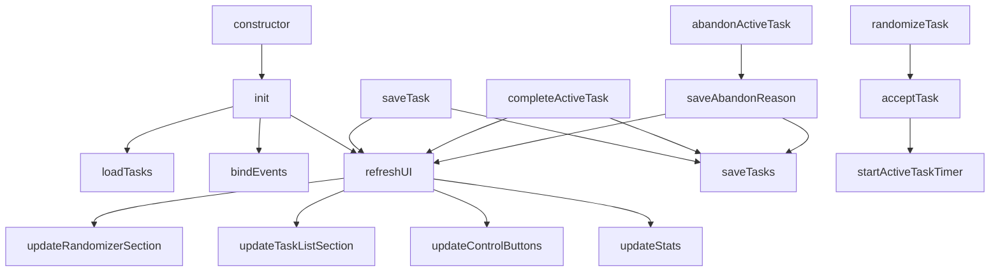
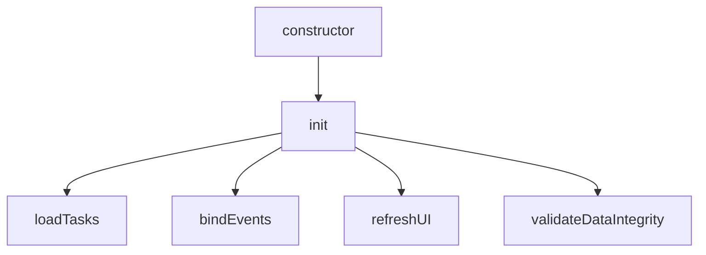
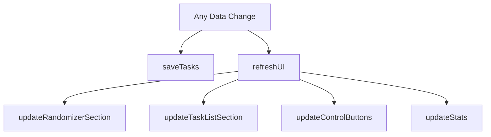
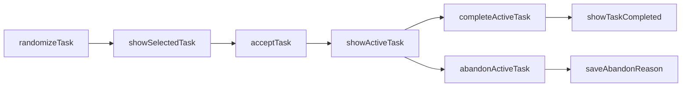
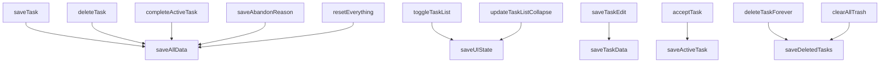
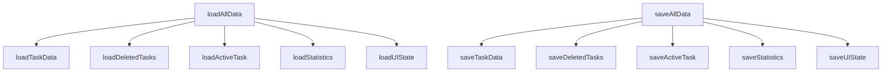

# DoThisApp Method Call Graph

This Mermaid flowchart shows all methods in the DoThisApp class and their calling relationships. Each box represents a method, and arrows point from each method to all methods it calls.

## High-Level Architecture Overview

## Detailed Method Call Relationships

Due to the complexity of the full call graph (73 methods with hundreds of relationships), here are the key architectural patterns:

### 1. Initialization Flow

### 2. UI Update Pattern

### 3. Task Lifecycle

### 4. Data Persistence Flow

### 5. localStorage Architecture (Fine-grained Operations)

## Method Count Summary

- **Total Methods**: 77 methods
- **Constructor/Initialization**: 4 methods
- **UI Management**: 15 methods  
- **Data Management**: 14 methods (expanded with fine-grained localStorage)
- **Task Operations**: 12 methods
- **Timer/Cooldown**: 5 methods
- **Utilities**: 8 methods
- **Trash Management**: 4 methods
- **Other**: 15 methods

## Key Observations

1. **Central Hub Methods**: `refreshUI()`, `saveAllData()`, and `showToast()` are called by many other methods
2. **Initialization Flow**: Constructor → init() → loadAllData() → multiple setup methods
3. **UI Update Pattern**: Most CRUD operations call `refreshUI()` and `updateStats()`
4. **Task Lifecycle**: Clear flow from randomization → acceptance → completion/abandonment
5. **Data Persistence**: State changes use fine-grained localStorage methods for better performance
6. **localStorage Architecture**: Split into specific save/load methods (saveTaskData, saveActiveTask, etc.) with orchestrator methods (saveAllData, loadAllData)

This diagram helps visualize the application's architecture and method dependencies for easier maintenance and debugging.