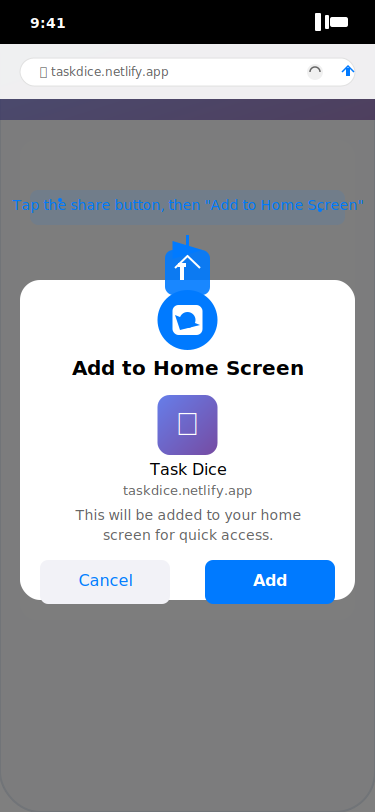

# Task Dice Screenshots

This directory contains visual documentation of the Task Dice app's user interface and key features.

## 📱 App Screenshots

### Main Application Screens

#### 1. Main Screen (`main-screen.svg`)


**Features shown:**
- App header with gradient branding
- Randomizer section with dice icon
- "Pick Random Task" button showing available task count
- Collapsed task list preview
- Footer statistics (Total Tasks, Completed)

**Key UI Elements:**
- Mobile-first responsive design
- Material Design inspired cards
- Clear visual hierarchy
- Accessible color scheme

---

#### 2. Task Selected (`task-selected.svg`)


**Features shown:**
- Selected task display with gradient background
- Task description in readable card format
- Action buttons: "Try Another" and "Let's Do It!"
- Collapsed sections for clean interface
- Visual feedback for task selection

**Key UI Elements:**
- Prominent task display
- Clear call-to-action buttons
- Gradient visual treatment for selected tasks
- Intuitive button layout

---

#### 3. Active Task Timer (`active-task.svg`)


**Features shown:**
- Active task with green gradient (indicating in-progress)
- Large countdown timer display (6:42:18 format)
- Circular progress indicator
- Action buttons: "Give Up" and "Mark as Done"
- Timer notification indicator

**Key UI Elements:**
- High-contrast timer display
- Visual progress indication
- Color-coded status (green for active)
- Monospace font for timer accuracy
- Animated elements for engagement

---

#### 4. Task List Management (`task-list.svg`)


**Features shown:**
- Expanded task management interface
- Add new task form with type selection
- Individual task items with status indicators
- Task metadata (type, cooldown, completion stats)
- Edit and delete buttons for each task
- Different task states (Available, Cooldown, Completed)

**Key UI Elements:**
- Comprehensive task management
- Status color coding:
  - 🟢 Green: Available tasks
  - 🟠 Orange: Tasks on cooldown
  - 🔵 Blue: Completed tasks
- Inline editing capabilities
- Statistical badges (completion counts)

---

#### 5. PWA Installation (`pwa-install.svg`)


**Features shown:**
- iOS Safari "Add to Home Screen" modal
- App icon preview
- Installation instructions
- Share button highlighting
- Progressive Web App workflow

**Key UI Elements:**
- Native iOS installation interface
- Clear installation guidance
- App branding consistency
- User-friendly instructions

---

## 🎨 Design System

### Color Palette
- **Primary Gradient**: `#667eea` to `#764ba2`
- **Available Status**: `#38a169` (Green)
- **Cooldown Status**: `#ed8936` (Orange)
- **Completed Status**: `#4299e1` (Blue)
- **Background**: `#f8f9fa` (Light Gray)
- **Text Primary**: `#2d3748` (Dark Gray)

### Typography
- **Primary Font**: Inter (Google Fonts)
- **Monospace**: Courier New (for timer display)
- **Mobile Optimized**: 16px+ for readability

### Layout Principles
- **Mobile-First**: Designed for 375px width
- **Touch-Friendly**: 44px+ button heights
- **Visual Hierarchy**: Clear information organization
- **Accessibility**: High contrast ratios, readable fonts

## 📊 User Interface States

### Task Status Indicators
| Status | Color | Icon | Description |
|--------|-------|------|-------------|
| Available | Green | ✅ | Ready for selection |
| Cooldown | Orange | ⏰ | Waiting period active |
| Completed | Blue | 🏁 | One-time task finished |
| Active | Green | 🎯 | Currently being worked on |

### App States
1. **Initial State**: Clean interface with randomizer ready
2. **Task Selected**: Shows chosen task with action options
3. **Active Timer**: 8-hour countdown with progress tracking
4. **Task Management**: Expanded list with full CRUD operations
5. **Installation**: PWA installation guidance

## 🔧 Technical Implementation

### SVG Screenshots
- **Vector Format**: Scalable for all screen sizes
- **Web Optimized**: Small file sizes, fast loading
- **Animated Elements**: Subtle animations for engagement
- **Accessibility**: Proper alt text and descriptions

### Responsive Design
- **Base Width**: 375px (iPhone standard)
- **Scalable**: Works on all mobile devices
- **Touch Optimized**: 44px minimum touch targets
- **PWA Ready**: Full-screen app experience

### Performance Considerations
- **Lightweight**: SVG format for minimal bandwidth
- **Progressive Enhancement**: Works without images
- **Offline Ready**: Local storage, no external dependencies
- **Fast Loading**: Optimized graphics and code

## 📱 Device Compatibility

### Tested Platforms
- ✅ **iOS Safari**: Full PWA support
- ✅ **Android Chrome**: Complete functionality
- ✅ **Desktop Browsers**: Chrome, Firefox, Edge
- ✅ **Mobile Browsers**: Responsive design

### PWA Features Shown
- **Home Screen Installation**: Add to home screen
- **Offline Functionality**: Works without internet
- **App-Like Experience**: Full-screen interface
- **Push Notifications**: Timer completion alerts

## 🎯 User Experience Highlights

### Key UX Principles
1. **Simplicity**: Clean, uncluttered interface
2. **Immediate Value**: Quick task randomization
3. **Visual Feedback**: Clear status indicators
4. **Progressive Disclosure**: Collapsible sections
5. **Mobile-First**: Touch-optimized interactions

### Accessibility Features
- **High Contrast**: Readable color combinations
- **Large Touch Targets**: Easy mobile interaction
- **Clear Iconography**: Intuitive visual symbols
- **Screen Reader Ready**: Semantic HTML structure

---

## 📝 Notes for Developers

### Screenshot Updates
When updating the app interface:
1. **Update SVG mockups** to match new designs
2. **Maintain consistency** with actual app appearance
3. **Test on real devices** to verify accuracy
4. **Update documentation** to reflect changes

### Design Guidelines
- Keep screenshots **representative** of actual functionality
- Maintain **visual consistency** across all mockups
- Use **realistic data** in examples
- Include **common use cases** in screenshots

### File Organization
```
docs/screenshots/
├── README.md           # This documentation
├── main-screen.svg     # Primary app interface
├── task-selected.svg   # Task selection flow
├── active-task.svg     # Timer functionality
├── task-list.svg       # Task management
└── pwa-install.svg     # Installation process
```

For questions about the design system or screenshots, refer to the main [Technical Documentation](../technical-details.md).